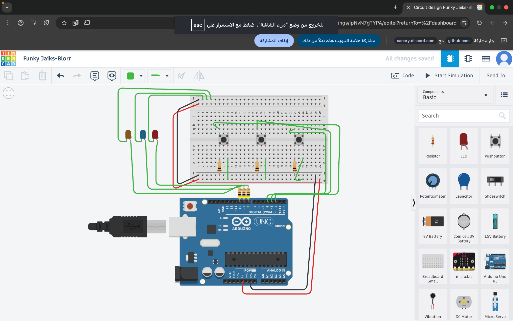

# Arduino Button-LED Project

This project demonstrates how to use 3 pushbuttons to control 3 LEDs using an Arduino UNO.  
Each button turns on a corresponding LED.

## 📷 Circuit Diagram



## 🔧 Components
- Arduino Uno R3
- Breadboard
- 3x LEDs (Red, Blue, Brown)
- 3x Pushbuttons
- 3x 220Ω resistors (LED current limiting)
- 3x 10kΩ resistors (pull-down resistors)
- Jumper wires

## 💡 How it Works
When you press a button, the Arduino reads its state using `digitalRead()` and turns on the associated LED with `digitalWrite()`.

## 📂 File Structure
```
/
├── ButtonLED.ino
├── README.md
└── README_circuit_image.png
```
